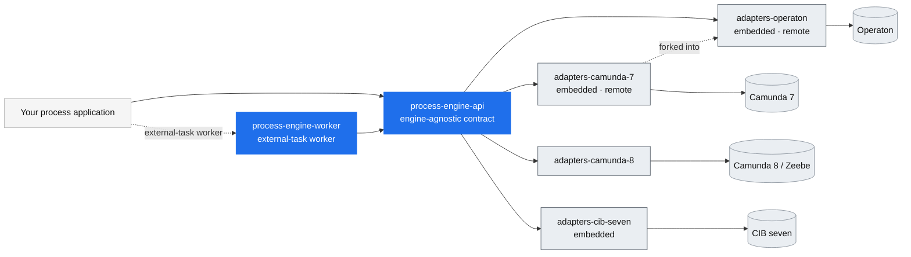

# Adapter landscape

How the engine adapters around the [Process Engine API](https://github.com/bpm-crafters/process-engine-api)
relate, which process engines they cover, and how far along each one is. This is maintainer
documentation — the public pitch lives in [`profile/README.md`](../profile/README.md), the full
reference on the [documentation site](https://bpm-crafters.github.io/process-engine-api-docs/stable/).

## The idea: one API, many engines

The [`process-engine-api`](https://github.com/bpm-crafters/process-engine-api) is an
**engine-agnostic** contract for building process applications. Your business code talks to the API;
an **adapter** binds that API to a concrete process engine. Swap the adapter (and its Spring Boot
starter) and the same application runs on a different engine — ideally with no code changes.

Two integration styles recur across the adapters:

- **Embedded** — the engine runs *inside* your Spring Boot application; service logic executes as
  in-process delegates.
- **Remote** — the engine runs *as a separate host*; your application attaches as an external-task
  **worker** (see [`process-engine-worker`](https://github.com/bpm-crafters/process-engine-worker))
  and owns only the logic.

## Overview

## The adapters

| Adapter | Engine | Integration modes | Latest release | API version |
| --- | --- | --- | --- | --- |
| [`process-engine-adapters-camunda-7`](https://github.com/bpm-crafters/process-engine-adapters-camunda-7) | Camunda Platform 7 | Embedded · Remote | `2026.06.2` | 1.7 |
| [`process-engine-adapters-camunda-8`](https://github.com/bpm-crafters/process-engine-adapters-camunda-8) | Camunda Platform 8 / Zeebe | Remote (SaaS & self-managed) | `2026.06.2` | 1.7 |
| [`process-engine-adapters-cib-seven`](https://github.com/bpm-crafters/process-engine-adapters-cib-seven) | CIB seven | Embedded | `2026.04.1` | 1.5 |
| [`process-engine-adapters-operaton`](https://github.com/bpm-crafters/process-engine-adapters-operaton) | Operaton | Embedded · Remote | *unreleased* | 1.7 |

Version/compatibility tables are maintained in each adapter's `README.md`.
