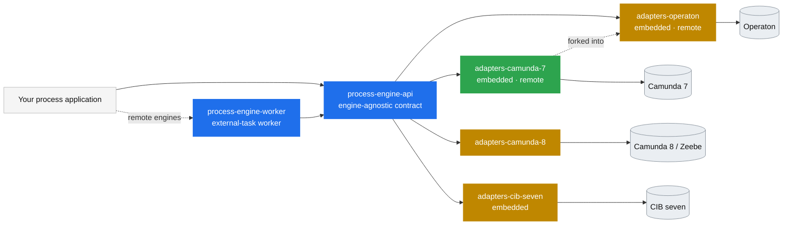

# Adapter landscape

How the engine adapters around the [Process Engine API](https://github.com/bpm-crafters/process-engine-api)
relate, which process engines they cover, and how far along each one is. This is maintainer
documentation — the public pitch lives in [`profile/README.md`](../profile/README.md), the full
reference on the [documentation site](https://bpm-crafters.github.io/process-engine-api-docs/stable/).

## The idea: one API, many engines

The [`process-engine-api`](https://github.com/bpm-crafters/process-engine-api) is an
**engine-agnostic** contract for building process applications. Your business code talks to the API;
an **adapter** binds that API to a concrete process engine. Swap the adapter (and its Spring Boot
starter) and the same application runs on a different engine — ideally with no code changes.

Two integration styles recur across the adapters:

- **Embedded** — the engine runs *inside* your Spring Boot application; service logic executes as
  in-process delegates.
- **Remote** — the engine runs *as a separate host*; your application attaches as an external-task
  **worker** (see [`process-engine-worker`](https://github.com/bpm-crafters/process-engine-worker))
  and owns only the logic.

## Overview

🟩 stable · 🟧 incubating

## The adapters

| Adapter | Engine | Integration modes | Lifecycle | Latest release (API) |
| --- | --- | --- | --- | --- |
| [`process-engine-adapters-camunda-7`](https://github.com/bpm-crafters/process-engine-adapters-camunda-7) | Camunda Platform 7 | Embedded · Remote | 🟩 stable | `2026.06.2` (API 1.7) |
| [`process-engine-adapters-camunda-8`](https://github.com/bpm-crafters/process-engine-adapters-camunda-8) | Camunda Platform 8 / Zeebe | Remote (SaaS & self-managed) | 🟧 incubating | `2026.06.2` (API 1.7) |
| [`process-engine-adapters-cib-seven`](https://github.com/bpm-crafters/process-engine-adapters-cib-seven) | CIB seven | Embedded | 🟧 incubating | `2026.04.1` (API 1.5) |
| [`process-engine-adapters-operaton`](https://github.com/bpm-crafters/process-engine-adapters-operaton) | Operaton | Embedded · Remote | 🟧 incubating | *unreleased* (API 1.7) |

Lifecycle badges follow the [Holisticon open-source lifecycle](https://github.com/holisticon#open-source-lifecycle).
Version/compatibility tables are maintained in each adapter's `README.md`.

## Notes per adapter

- **Camunda 7** — the reference adapter and the only **stable** one. Ships both an embedded core
  (`c7-embedded-*`) and a remote core (`c7-remote-*`) built on the Camunda 7 community REST client,
  plus a shared `c7-adapter-common` and `adapter-testing` fixtures.
- **Camunda 8** — targets Zeebe (Camunda 8 SaaS & self-managed); a single core (`c8-core`) and
  Spring Boot starter. Camunda 8 has no embedded mode, so the integration is inherently remote/worker-based.
- **CIB seven** — an open-source Camunda-7-compatible engine; currently **embedded only**. Requires
  **Spring Boot 4** from the next release (stay on `2026.04.1` for Spring Boot 3.5).
- **Operaton** — an API-compatible open-source **fork of Camunda 7**, so this adapter is *derived from*
  the Camunda 7 adapter: both embedded and remote carry over, and the remote adapter reuses the
  Camunda 7 community REST client against Operaton's compatible REST API. Not yet released to Maven Central.

## Keeping this current

There is no auto-generation yet — update the diagram, the table and the per-adapter notes by hand when
an adapter is added, renamed, released, or changes lifecycle. Each adapter's own `README.md` carries the
authoritative version/compatibility matrix; keep the "latest release" column here in sync with those.

> **Doc-site gap:** the Operaton adapter is not yet wired into the docs-site
> [`mkdocs.yml`](https://github.com/bpm-crafters/process-engine-api-docs/blob/main/mkdocs.yml)
> `multirepo` imports (only camunda-7, camunda-8 and cib-seven are). Add it there so its quickstart
> and reference pages publish to the documentation site.
