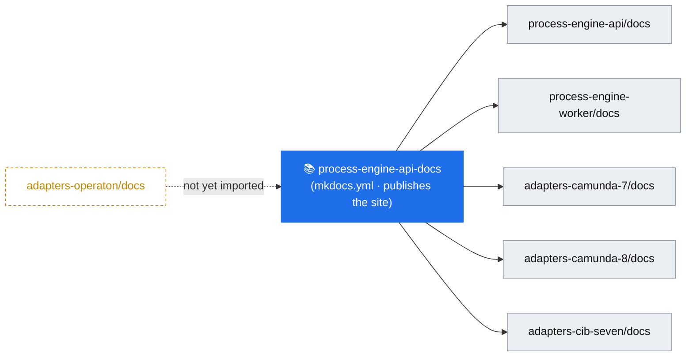

# Documentation landscape

A single map of **where every piece of documentation lives** across the bpm-crafters org — the
published site, the per-repo docs that feed it, and the supporting material. The public pitch lives in
[`profile/README.md`](../profile/README.md); the adapter map in [`adapters.md`](adapters.md).

## 📖 The published site

Everything user-facing is aggregated into one MkDocs (Material) site:

- **🌐 [bpm-crafters.github.io/process-engine-api-docs/stable](https://bpm-crafters.github.io/process-engine-api-docs/stable/)**
- Source & build config: [`process-engine-api-docs`](https://github.com/bpm-crafters/process-engine-api-docs)
  ([`mkdocs.yml`](https://github.com/bpm-crafters/process-engine-api-docs/blob/main/mkdocs.yml))

The site is **multi-repo**: page bodies live in each library's `docs/` folder on its `develop` branch and
are pulled together at build time (`mkdocs-multirepo`). Versioned with `mike`. So to edit a page, edit
the `docs/` file in the repo it belongs to — not the docs repo.

## 🗂️ Site sections → source

What each part of the site is, and which repo owns it.

| Section | Content | Owning repo |
| --- | --- | --- |
| **Introduction** | Motivation, clean architecture, library components | [`process-engine-api`](https://github.com/bpm-crafters/process-engine-api/tree/develop/docs) |
| **Quick Start** | Basic setup + per-engine quickstarts (C7 embedded/remote, C8 SaaS, CIB seven) | api + each adapter's `docs/` |
| **Reference** | Deployment, Process, Correlation, Signal, Task-Subscription, Service-/User-Task, User-Task-Support APIs | [`process-engine-api`](https://github.com/bpm-crafters/process-engine-api/tree/develop/docs) |
| **Reference › Worker** | Annotation-based external-task worker | [`process-engine-worker`](https://github.com/bpm-crafters/process-engine-worker/tree/develop/docs) |
| **Adapters** | Per-engine reference: C7 embedded/remote, CIB seven, C8 | each adapter repo's `docs/` |
| **Developers** | Contribution guide, project setup | [`process-engine-api-docs`](https://github.com/bpm-crafters/process-engine-api-docs) |

## 📦 Documentation by repository

Every repo in the org and where its docs sit.

### Core

| Repo | What it is | Docs |
| --- | --- | --- |
| [`process-engine-api`](https://github.com/bpm-crafters/process-engine-api) | The engine-agnostic API (STABLE) | `README.md` · [`docs/`](https://github.com/bpm-crafters/process-engine-api/tree/develop/docs) → site |
| [`process-engine-worker`](https://github.com/bpm-crafters/process-engine-worker) | Annotation-based external-task worker (STABLE) | `README.md` · [`docs/`](https://github.com/bpm-crafters/process-engine-worker/tree/develop/docs) → site |
| [`process-engine-api-docs`](https://github.com/bpm-crafters/process-engine-api-docs) | Aggregates & publishes the site | [`README.md`](https://github.com/bpm-crafters/process-engine-api-docs) · `docs/` (intro, reference index, developer guide) |

### Engine adapters

| Repo | Docs pages (`docs/`) |
| --- | --- |
| [`process-engine-adapters-camunda-7`](https://github.com/bpm-crafters/process-engine-adapters-camunda-7) | quickstart-c7-embedded · quickstart-c7-remote · reference-c7-embedded · reference-c7-remote |
| [`process-engine-adapters-camunda-8`](https://github.com/bpm-crafters/process-engine-adapters-camunda-8) | quickstart-c8-saas · reference-c8 |
| [`process-engine-adapters-cib-seven`](https://github.com/bpm-crafters/process-engine-adapters-cib-seven) | quickstart-cib-seven-embedded · reference-cib-seven-embedded |
| [`process-engine-adapters-operaton`](https://github.com/bpm-crafters/process-engine-adapters-operaton) | quickstart-operaton-embedded · quickstart-operaton-remote · reference-operaton-embedded · reference-operaton-remote ⚠️ *not yet published to the site* |

> Some adapters also carry an `AGENTS.md` (agent/contributor working notes) at the repo root, and an
> `examples/` module you can read as executable documentation.

### Supporting

| Repo | What it is | Docs |
| --- | --- | --- |
| [`awesome-bpm-tools`](https://github.com/bpm-crafters/awesome-bpm-tools) | Curated list of BPM(N) engines, frameworks, modelers & tooling | `README.md` (the list) · `CONTRIBUTING.md` |
| [`skills`](https://github.com/bpm-crafters/skills) | AI-agent skills for agent-agnostic BPM solutions | — (early) |
| [`bpm-crafters`](https://github.com/bpm-crafters/bpm-crafters) | The bpm-crafters website (Vue) | site content |
| [`bpm-crafters-maven-parent`](https://github.com/bpm-crafters/bpm-crafters-maven-parent) | Shared Maven parent | `README.md` |
| [`.github`](https://github.com/bpm-crafters/.github) | Org profile & this maintainer documentation | this folder |

## Conventions

- **Public how-to and reference** → the repo's `docs/` folder (auto-published to the site).
- **Getting started / install / compatibility matrix** → the repo `README.md`.
- **Cross-repo, org-level maps** (this file, [`adapters.md`](adapters.md)) → here in `.github/docs/`.
- To surface a new adapter's pages on the site, add it to the `multirepo` block and `nav` in
  [`mkdocs.yml`](https://github.com/bpm-crafters/process-engine-api-docs/blob/main/mkdocs.yml).
